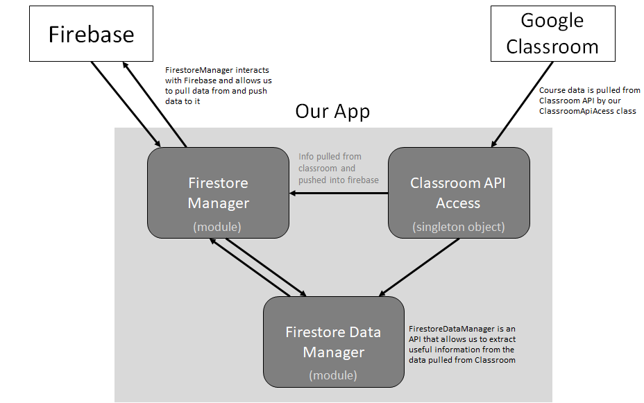

# TDSB-Student Agenda (Team 1)

## Description 
Our application is a mobile app for both iOS and Android where students organize their school work and set goals to help them complete assignments. An increasing number of students are no longer using an agenda so those students need to be able to organize their work and manage their time effectively. This is one of the main purposes of the app. Students will be able to view their assignments which is pulled from Google Classroom. They can then add goals attached to those assignments (e.g. finish brainstorming, finish intro paragraph etc.) and set the time when this goal/task is to be completed. They would be able to view upcoming goals/tasks and view them on a calendar. Students will also be able to choose to be alerted for upcoming goals. They will also able to view task completion performance (tasks completed on-time vs. late) so they can reflect and improve on their time management. A teacher can use the app to view their students goals view their goal completion performance so that they can make sure their students are on track.

## Key Features

### Fully Working (Front-End and Back-End)
1. Login: Users can log in with their Google account. When the app is opened, it goes to a login page where the user can press the login button to sign in with their Google account. Authentication is done with Firebase. If the log in fails a message will be displayed to the user. The app will also prompt for permissions to view and manage the Google Classroom data of the account they are using to log in (if the user has not already authorized the app to do so).
2. My Courses Screen: The course page is for students to view the classes they are currently in. The page pulls courses from Firestore and displays it onto the page. A button is created for every course. When the user clicks on a course a page listing the course works (assignments) for that specific course will show up.
3. Course Works Screen: Students get here by pressing on a course on the "My Courses" page. This page pulls the course works from Firestore for the specific course and displays it onto the screen in chronological order.

### Working Front-End Only
1. Calendar Screen: Calendar screen shows a monthly calendar that is initially set to the current month and day. Clicking on a day shows the tasks due on that day. The calendar days with tasks have dots underneath them with more dots representing more tasks to be done on that day (max of 4 dots).
2. Add Goals Screen: This screen allows students to add goals. Students choose a subtask from a list of pre-determined subtasks and the date they want the subtask to be completed by. Then they press on the add button to add the goal.
3. Goal List Screen: This screen lists goals which are separated by date. They can see their task and what assignment is associated with that task.
5. Performance Screen: This screen includes a pie chart comparing how many tasks are completed on time and completed late. This screen also shows the values for those as well as how many tasks have been created and are remaining.
6. Dashboard (Main Screen): This screen has a progress bar showing task completion performance (tasks completed on-time vs late). Pressing on the progress bar will move you to the performance screen with more detailed performance information. This screen lists some upcoming tasks in the same format as the Goal List Screen. The user can click on the "View More Tasks" button to go to the Goal List Screen which lists all the goals.

### Current Issues
All current issues that we are aware of on the APK are listed in the [Issues tab on github](https://github.com/csc301-fall-2019/team-project-tdsb-team-1/issues)

## Instructions

We will provide the [APK file on Google Drive](https://drive.google.com/open?id=1jB17rdsIsMsg4Ml-wohERdrAKem1_m_T). The APK can be installed on a phone running Android.

 ### Emulator Installation Instructions:
1) [Download Android Studio](https://developer.android.com/studio)

2) In Android Studio, [create an Android Virtual Device](https://developer.android.com/studio/run/managing-avds#createavd)

3) In the toolbar, select the AVD that you want to run the application on from the target device drop-down menu.

4) [Open the AVD Manager](https://developer.android.com/studio/run/managing-avds)

5) Double-click on an AVD, or click Run. The emulator will load.

6) To install an APK file on the emulated device, drag an APK file onto the emulator screen. An APK installer dialog will appear. When the installation completes, you can view the application in the apps list of the device.

7) The application will now be available to use. Open it and sign in using your Gmail account.

### Android Device Installation Instructions:
1) On your Android Device, download the APK from the provided Google Drive link

2) In your files, an installation dialogue will appear. After the installation completes, the application will be available to use. Open it and sign in.

#### Running the app

 We will also provide a dummy Google credential. Here are the credentials for a dummy Google account:
 * Email: tdsbprojectdummy@gmail.com
 * Password: tdsb4321

 This app is to be used only in portrait mode. When the app is opened, it will show the login screen. To login, press the login button. There will be a popup to choose a Google account. You will scroll down and press "Add another account" and add the dummy account. Once you are signed in the app and it is the first time running it the app should prompt you to allow Google Classroom permissions. Press allow.

 You will then be loaded into the Dashboard (Main Screen). Pressing on the progress bar will move you to the Performance Screen. The user can click on the "View More Tasks" button to go to the Goal List Screen.

 There is a bottom navigation bar that is always there where the user can quickly go to other commonly used screens. Currently only the Dashboard Screen and Calendar Screen is available in bottom navigation bar.

 Pressing the hamburger menu button in the top left will open a drawer where the user can get to the following other screens:
 * My Courses: Goes to the My Courses Screen. Clicking on any course will lead to a Course Works Screen where the course works (e.g. assignments) for that specific course is listed. As mentioned above, the data here is all pulled from Firestore. If you go to the menu and go to My Courses again and choose a different course, you will see there is a different amount of assignments being displayed.
 * Settings: Goes to the Settings screen. This screen is currently empty and just simply displays cards of text in a column representing settings students will need. These settings have not been implemented yet.
 * Calendar Screen: Goes to the Calendar Screen. Clicking on a day shows the tasks due on that day.
 * Add Goal: Goes to the Add Goals Screen. Clicking the subtask dropdown allows you to pick from a list of pre-determined subtasks. Clicking the button with the date allows you to choose the goal's due date. Pressing "Add" should add the goal (not yet implemented in the back-end).
 * Goal List: Goes to the Goal List screen. You can scroll to view all the tasks.
 * Performance: Goes to the performance screen. If you hold your finger on top of the pie chart, it expands the section your finger is over and highlights the matching legend entry.
 * Log Out: Logs you out of the app and puts you to the screen where you can log in.
 * Dashboard: Goes to the Dashboard (Main Screen).

## Architecture

The app uses flutter as a frontend framework, and firebase as a backend framework to store data and link google classroom through students accounts

## Helpful Links

[Documentation](../Documentation.md)

